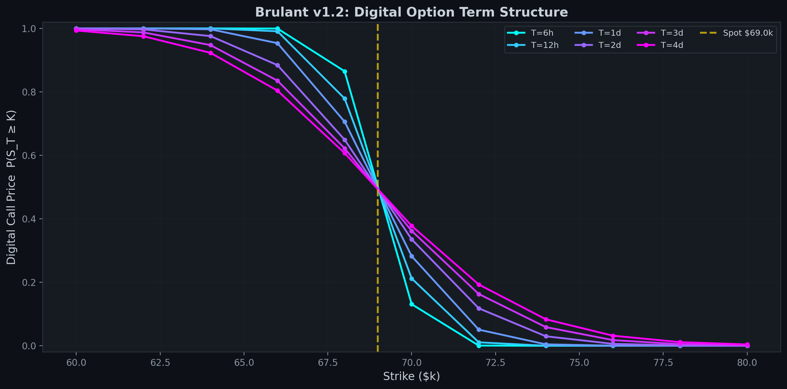
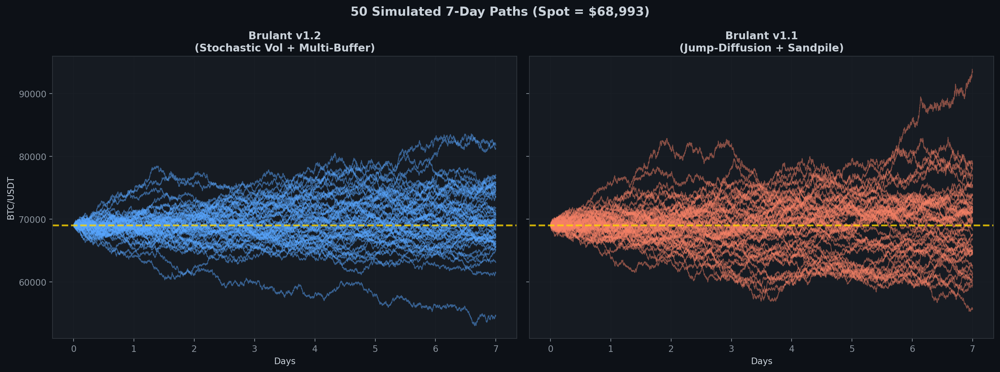

<div align="center">

# The Brulant Model

**A Multi-Factor Stochastic Differential System for Cryptocurrency Microstructure**

[](https://www.python.org/downloads/)
[]()

</div>

---

## Quick Start

```bash
pip install numpy scipy requests matplotlib

# Run the full benchmark comparison (v1.2 vs GBM, Heston, Merton, SABR)
python benchmark_v12.py

# Calibrate the v1.2 model on live Binance data
python fit_nojump.py

# Price digital options (60k-80k strikes, 0-4 day maturities)
python validate_and_price.py

# Generate all figures
python generate_figures.py
```

---

## Overview

Traditional quantitative models (Black-Scholes, Heston, Merton) were designed for low-volatility equities. They fail on cryptocurrency because they assume continuous price convergence and independence between volatility and market shocks.

The **Brulant Model** is a proprietary SDE system engineered for the 24/7, hyper-leveraged reality of crypto markets. It exists in two formulations:

| | **v1.1** (Jump-Diffusion) | **v1.2** (Stochastic Mean-Reversion) |
|---|---|---|
| **Core mechanic** | Sandpile jump intensity + Elasticity Buffer | Stochastic vol target + Multi-layer buffers |
| **OOS median loss** | 88.95 | **4.08** |
| **Loss stability (std)** | 212.88 | **0.91** |
| **Std ratio** | 1.434 | **1.194** |
| **Best for** | Theoretical framework, liquidation modelling | Production pricing, calibration |

---

## Benchmark Results

Calibrated on 10,000 BTC/USDT 1-minute candles with 50/50 chronological train/test split:

<div align="center">


</div>

| Model | Median OOS Loss | Loss Std | Std Ratio |
|-------|:-:|:-:|:-:|
| **Brulant v1.2** | **4.08** | **0.91** | **1.194** |
| GBM (Black-Scholes) | 4.82 | 1.25 | 1.333 |
| Heston | 4.89 | 1.03 | 1.283 |
| Merton Jump-Diffusion | 4.85 | 5.54 | 1.063 |
| SABR | 5.47 | 1.13 | 1.466 |
| Brulant v1.1 | 88.95 | 212.88 | 1.434 |

---

## The Mathematics

### v1.2: Stochastic Mean-Reversion + Multi-Layer Buffers

$$dS_t = \mu(B_t^{\text{eff}}) S_t \, dt + \sigma_t S_t \, dW_t^S$$

$$d\sigma_t = \alpha(\bar{\sigma}_t - \sigma_t) \, dt$$

$$d\bar{\sigma}_t = \alpha_s(\bar{\sigma}_0 - \bar{\sigma}_t) \, dt + \xi_s \, dW_t^{\bar{\sigma}}$$

$$dB_t^{(k)} = -\kappa_k B_t^{(k)} \, dt + \theta_k \, d(\log S_t), \quad k \in \{\text{fast}, \text{slow}\}$$

**Key innovations:**
- **Two-layer vol hierarchy:** $\sigma_t$ tracks a wandering target $\bar{\sigma}_t$, which itself reverts to $\bar{\sigma}_0$. Generates vol-of-vol from diffusion alone.
- **Multi-layer directional buffers:** Fast buffer ($\kappa = 95.7$, ~10 min half-life) captures intraday momentum. Slow buffer ($\kappa = 4.5$, ~56 day half-life) captures weekly trends. Optimizer weight: $w_{\text{slow}} = 0.56$.
- **Self-correcting drift:** The buffer mechanism provides intrinsic Euler-Maruyama discretization correction (see [paper](paper/brulant_model_paper.tex), Theorem 3.1).

### v1.1: Jump-Diffusion + Sandpile + Elasticity Buffer

$$dS_t = \mu(B_t) S_t \, dt + \sigma_t S_t \, dW_t^S + S_{t-}(Y_t - 1) \, dN_t$$

$$\lambda_t = \frac{\lambda_0}{\sigma_t + \varepsilon} e^{-M_t}$$

**The Sandpile Mechanic:** Low volatility $\rightarrow$ high jump probability. Each jump resets the tension. The Elasticity Buffer dictates jump *direction*: $j_m = -\phi B_{t-}$.

---

## Digital Option Pricing

<div align="center">



</div>

Prices computed via Monte Carlo (100k-200k paths, 1-minute step resolution). Deep OTM wing comparison at +3 days:

| Strike | v1.2 | v1.1 | GBM | Heston | Merton |
|--------|:----:|:----:|:---:|:------:|:------:|
| $78k | 0.96% | 2.47% | 1.48% | 0.06% | 0.35% |
| $80k | 0.30% | 1.01% | 0.38% | **0.00%** | 0.06% |

Heston and Merton kill the deep OTM wings entirely. v1.2 prices conservatively but non-zero.

---

## Simulated Paths

<div align="center">



</div>

---

## Project Structure

```
.
├── backtest_buffer_model.py    # v1.1 simulation engine + calibration
├── digital_option.py           # 3-factor sandpile simulation + pricing
├── fit_sandpile.py             # SMM calibration framework
├── experiment_v12.py           # v1.2 simulation engine (stoch vol + multi-buffer)
├── fit_nojump.py               # v1.2 DE calibration
├── benchmark_v12.py            # Head-to-head: v1.2 vs GBM, Heston, Merton, SABR
├── benchmark_comparison.py     # v1.1 benchmark comparison
├── validate_and_price.py       # 6-phase validation + digital option grid
├── generate_figures.py         # Generate all repo figures
├── forward_test_buffer.py      # Walk-forward OOS testing
├── generate_repo_assets.py     # Original benchmark path visualization
├── paper/
│   └── brulant_model_paper.tex # Full working paper (proofs, analysis, results)
├── assets/                     # Generated figures
└── requirements.txt
```

## Requirements

```
numpy>=1.20.0
scipy>=1.7.0
requests>=2.25.0
matplotlib>=3.5.0
```

Optional for GPU acceleration:
```
pip install torch --index-url https://download.pytorch.org/whl/cu124
```

---

## Key Discovery

At 1-minute resolution, standard jump intensities ($\lambda_0 \approx 1.2$) produce **~0.005 jumps per Monte Carlo path**. The entire jump mechanism---sandpile, trapdoor, memory---is structurally decorative at this timescale. This finding motivated the v1.2 reformulation and has implications for all jump-diffusion models applied to high-frequency crypto data.

---

**Author:** James Brown-Brulant
**Status:** Production-Ready Monte Carlo Pricing Engine
**Paper:** [`paper/brulant_model_paper.tex`](paper/brulant_model_paper.tex)
</div>
